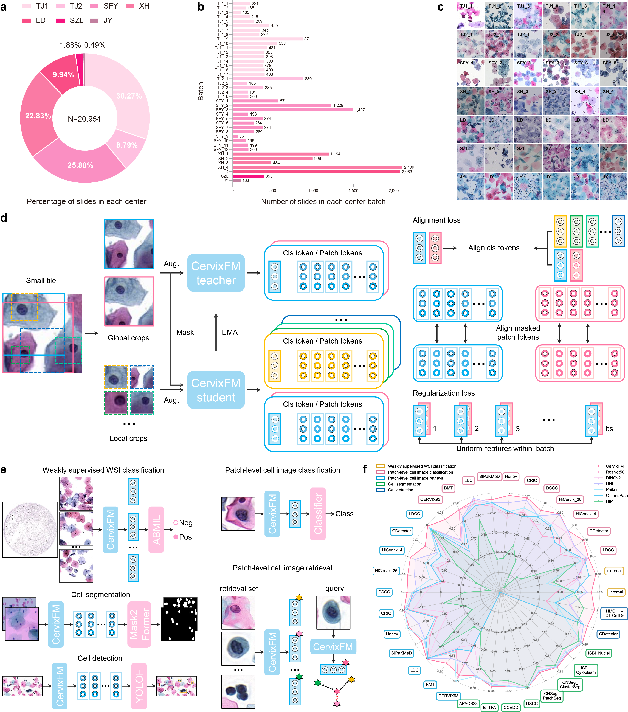

# CervixFM: A General Foundation Model for Cervical Cytology Image Analysis

Cervical cancer remains one of the most significant threats to women's health globally, especially in low- and middle-income countries (LMICs) where cytology serves as the primary screening modality. Conventional cytology screening for abnormalities relies on pathologists to review slides, which is time-consuming and labor-intensive. While deep learning has play an increasingly important role in automated analysis of cervical cytology, existing methods typically depend on abundant manual annotations and lack general-purpose capabilities across tasks and datasets. Faced with such challenges, we introduce CervixFM, the first general foundation model for cervical cytology image analysis. We curated a massive pretraining dataset using 18,375 whole-slide images (WSIs) collected from 38 batches across four medical centers, resulting in over 64 million tiles. Leveraging the large-scale data, CervixFM learns feature primitives of cervical cells via DINOv2 self-supervised framework. Our model, based on a large vision transformer (ViT-Large) architecture, has been systematically evaluated on five types of common analysis tasks, including slide-level classification, patch-level classification, retrieval, segmentation, and detection, and it has achieved improved performance surpassing current state-of-the-art (SOTA) models in a total of 34 cervical abnormality analysis. Our evaluation work covers nearly all publicly available datasets in the field, ensuring the comprehensiveness and reliability of the evaluation results. CervixFM can effectively captures robust morphological representations of cervical cells, offering a new paradigm to mitigate the two long-standing bottlenecks of high annotation costs and poor cross-task and cross-dataset generalizability.



## Requirements

- python 3.8
- torch 2.4.0
- torchvision 0.19.0
- CUDA 12.4

## Model weights

CervixFM is a ViT-Large architecture model, and its pretrained weights can be downloaded from [Google Driver](https://drive.google.com/file/d/1fvAy0-ovoD4WCg8423HWUv8H-P2fdr5l/view?usp=drive_link) or [Baidu Netdisk](https://pan.baidu.com/s/16cDNp4Qu-FRghSxknII8mg?pwd=yhmm)

## Quick usage

- Download above pretrained weights and save them to the `CervixFM/pretrained` folder
- Create and load CervixFM model

```python
from omegaconf import OmegaConf
from model.vision_transformer import vit_large
import torch

config = OmegaConf.load('config/custom_test.yaml')
backbone = vit_large(
	patch_size=config.student.patch_size,
    init_values=config.student.layerscale,
	ffn_layer=config.student.ffn_layer,
	block_chunks=config.student.block_chunks,
	qkv_bias=config.student.qkv_bias,
	proj_bias=config.student.proj_bias,
	ffn_bias=config.student.ffn_bias,
	num_register_tokens=config.student.num_register_tokens,
	interpolate_offset=config.student.interpolate_offset,
	interpolate_antialias=config.student.interpolate_antialias,
	)

checkpoint = torch.load('pretrained/CervixFM.pth', map_location='cpu')
backbone.load_state_dict(checkpoint)

# freeze backbone
# for param in self.backbone.parameters():
#     param.requires_grad = False
```

- **Weakly supervised WSI classification**

  We employed [ABMIL](https://github.com/AMLab-Amsterdam/AttentionDeepMIL) to perform weakly supervised WSI classification, using CervixFM to extract instance features.

- **Supervised patch-level image classification (Linear probing)**

  Training

  ```bash
  python -m downstream.instance_classification.CDetector_train --model ViT_classifier --data_path CDetector_dataset_path --feature_path CDetector_training_image_feature_save_path --save_path result_save_path --pretrained_path ./pretrained/CervixFM.pth --num_class 11 --ViT_freeze --seed 42 --device 0 &
  ```

  `--model`: feature extractor of the classification model. `ViT_classifier` denotes CervixFM.

  `--data_path`: dataset path. The storage structure of the dataset is as follows:

  ```
  ├── train/            # training set
  ├── test/             # test set
  ├── train.npy         # labels of training set
  └── test.npy          # labels of test set
  ```

  or

  ```
  ├── data/             # dataset
  └── data_label.npy    # labels of dataset
  ```

  The `Instance_Dataset` class is compatible with both dataset structures. For further details, please refer to the implementation in `downstream/instance_classification/dataset/instance_dataset.py`.

  `--feature_path`: the storage path for cervical cell image features of training set extracted by the frozen feature extractor. This is only applicable when `--ViT_freeze` is specified as `True`.

  `--save_path`: the storage path for training and test results, including logs, classification model weights, and test results.

  `--pretrained_path`: the path of pretrained CervixFM weights. This is only applicable when `--model` is specified as `ViT_classifier`.

  `--num_class`: the number of classes for the classification task.

  `--ViT_freeze`: whether to freeze the extractor.

  `--seed`: random seed. This is only applicable when the dataset has no train-test split.

  Test

  ```bash
  python -m downstream.instance_classification.CDetector_test --data_path CDetector_dataset_path --feature_path CDetector_test_image_feature_save_path --save_path result_save_path --model ViT_classifier --model_path result_save_path/model_weights.pth --num_class 11 --ViT_freeze --seed 42 --device 0 &
  ```

  `--feature_path`: the storage path for cervical cell image features of test set extracted by the frozen feature extractor. This is only applicable 

  when `--ViT_freeze` is specified as `True`.

- **Label efficiency of patch-level image classification**

  Training

  ```bash
  python -m downstream.instance_classification.CDetector_train --model ViT_classifier --data_path CDetector_dataset_path --feature_path CDetector_training_image_feature_save_path --save_path result_save_path --pretrained_path ./pretrained/CervixFM.pth --num_class 11 --ViT_freeze --label_efficiency 0.5 --seed 42 --device 0 &
  ```

  `--label_efficiency`: the sampling ratio of training data.

  `--seed`: random seed. This is used for sampling different training data.

  Test

  ```bash
  python -m downstream.instance_classification.CDetector_test --data_path CDetector_dataset_path --feature_path CDetector_test_image_feature_save_path --save_path result_save_path --model ViT_classifier --model_path result_save_path/model_weights.pth --num_class 11 --ViT_freeze --label_efficiency 0.5 --seed 42 --device 0 &
  ```

- **Patch-level image retrieval**

  ```bash
  python -m downstream.instance_retrieval.CDetector_retrieval --model ViT_classifier --data_path CDetector_dataset_path --key_feature_path CDetector_training_image_feature_save_path --query_feature_path CDetector_test_image_feature_save_path --save_path result_save_path --seed 42 --device 0 &
  ```

  `--key_feature_path`: the storage path for cervical cell image features of training set extracted by the frozen feature extractor.

  `--query_feature_path`: the storage path for cervical cell image features of test set extracted by the frozen feature extractor.

  `--seed`: random seed. This is only applicable when the dataset has no train-test split.

- **Patch-level image retrieval on other cytology datasets**

  ```bash
  python -m downstream.instance_retrieval.BM_retrieval --model ViT_classifier --data_path BM_dataset_path --key_feature_path BM_training_image_feature_save_path --query_feature_path BM_test_image_feature_save_path --save_path result_save_path --seed 42 --device 0 &
  ```

  `--seed`: random seed. This is only applicable when the dataset has no train-test split.

- **Cell segmentation**

  We employed [Mask2Former](https://github.com/facebookresearch/Mask2Former) to perform cell segmentation, using CervixFM to extract cervical cell image features and [ViT-Adapter](https://github.com/czczup/ViT-Adapter) to generate multi-scale features.

- **Cell detection**

  We employed [YOLOF](https://github.com/megvii-model/YOLOF) to perform cell detection, using CervixFM to extract cervical cell  image features.

